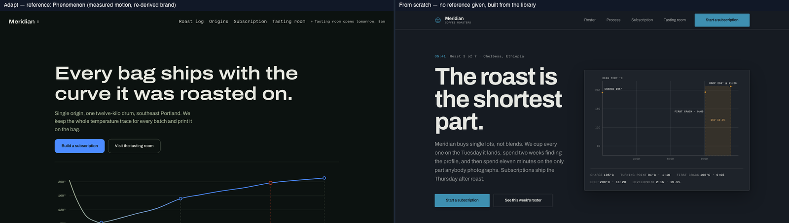
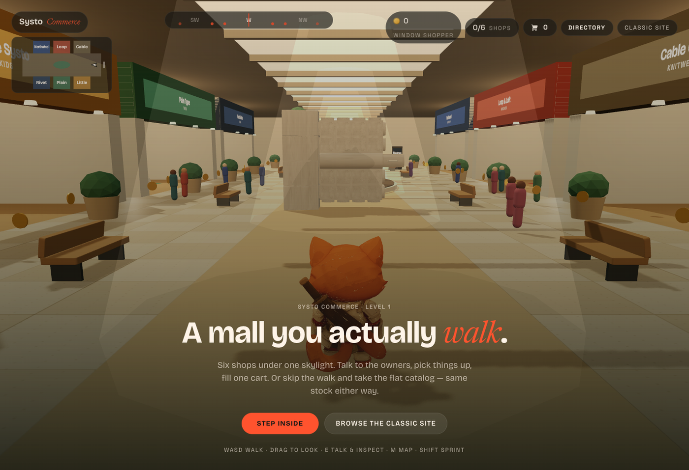
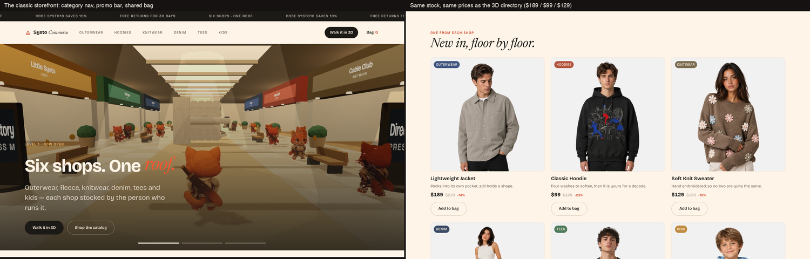

# swipefile

*The swipe file that measures.*

Great designers have always kept swipe files: screenshots, links, motion studies
of work worth learning from. This is that folder, made rigorous. It captures a
reference site's actual design system (layout, tokens, type, interaction states,
motion, copy), **verifies every number by measurement** instead of describing it
in prose, and remembers what it learned in a local library that gets smarter with
every site it studies.

It is a Claude Agent Skill. `SKILL.md` is the procedure an agent follows,
`scripts/` is the instrumentation that makes the procedure hold, `library/` is
the accumulated memory, and this README is for the human deciding whether to
install it.

The clones are the training material, not the deliverable. Each capture leaves a
measured entry behind, and those entries are what make the next build better,
including builds with no reference at all. See
[Every clone is a training input](#every-clone-is-a-training-input).

Built by [Kyle at Systo](https://www.systo-ai.com).

---

## Why this exists

Two failure modes, both common, both expensive.

**A "clone" that isn't one.** Ask an agent to rebuild a site from a screenshot
and a description, and you get a page that is *approximately* right: close enough
to read as a knockoff, not close enough to actually replace the thing it copied.
Every wrapped line and every off-by-8px gap is a transcription error, because
nothing was ever measured.

**Original work that reads as generated.** Ask for a landing page with no
reference at all, and you get the same defaults every model reaches for. Cream
background, a serif display face, a terracotta accent, three feature cards, a
testimonial, a footer. Not because the model is untalented, but because it has
nothing *specific* to draw from, so it draws from the mean.

swipefile is built against both, with the same tool: **measure, don't guess.**
A captured cubic-bezier is not replaced by `ease-in-out`. A type scale is kept as
the ratio that produced it, not five px values. And once measured, it is
remembered, so the next original build has real systems to draw from instead of
the generic answer.

## See it work

**Match: a local mirror of apple.com, built from bytes.** Left is the live
site. Right is what swipefile built and served from disk: same
markup, same fonts fetched and served locally, same assets, verified against the
reference with a pixel diff, so the claim survives someone checking it.

<p align="center">
  
</p>

**The library learning loop, working.** Same brief ("landing page for an
independent coffee roastery, Portland"), built twice. Left carries measured
motion and rhythm from a captured reference (Phenomenon, at `Motion fidelity:
spec` in the library). Right was built **with no reference given at all**, and
independently avoided the cream/serif/terracotta default by citing the library
instead. That is real behavior, not a claim:

<p align="center">
  
</p>

Both pages carry **zero AI-writing-tell findings** from `copy-gate.py`, with no
promotional filler, no inflated vocabulary, no rule-of-three padding, and both
ship under budget at 9.7KB / 4.0KB and 8.0KB / 2.9KB of gzipped CSS and JS.
Neither ships JSON-LD, so both fail the gate's structured-data check, which is
what a gate is for.

## Built with swipefile

**[Systo Commerce](https://systo-commerce.vercel.app)** is a storefront you walk
through instead of scroll: six shops under one skylight, a fox you steer with
WASD, shopkeepers you can talk to, and one cart shared with the flat catalog.

**Walk it yourself: [systo-commerce.vercel.app](https://systo-commerce.vercel.app)**

<p align="center">
  
</p>

Press M anywhere on the floor and the directory opens. Each shop lists a named
owner, Maya Torres at Northwind and Dev Patel at Loop & Loft, alongside its
actual stock and prices, with a Guide Me button that walks the fox over to it.

The same six shops sell the same things on a flat storefront at
[/shop.html](https://systo-commerce.vercel.app/shop.html), for anyone who would
rather just buy a hoodie:

<p align="center">
  
</p>

One catalog serves both paths. Lightweight Jacket is $189 in the in-world
directory and $189 in the flat grid, Classic Hoodie is $99 in both, Soft Knit
Sweater is $129 in both. One cart, either route.

A browser without WebGL gets the third path: the floor drops away and the store
stays, with the full catalog, the cart and checkout all still working. Shipping
the 3D floor and the flat store as one shop, so the spectacle never becomes the
requirement, is the kind of decision the gates in this repo exist to protect.

## The five jobs

One skill, five outcomes, chosen by how you ask:

| You say | You get |
|---|---|
| `swipefile https://stripe.com` (a bare URL) | **Match.** Rebuild it faithfully: full site crawl, working local nav, real fonts and assets served locally, verified to 95% pixel similarity or better before you see it. |
| `like stripe.com but for my espresso brand, here's my content` | **Adapt.** The reference's *system* (rhythm, motion character, structural logic) with your content and brand. Never mistakable for the reference, and never a generic default either. |
| `what animations does linear.app use?` | **Audit.** The extraction *is* the answer. Plain language plus an implementable spec covering trigger, duration, easing, stagger and scroll offsets, confirmed by probing the page's own runtime, because bundle comments name libraries the site never loads. |
| `use linear.app's hero animation on my hero section` | **Transfer.** One measured mechanism, translated into your existing stack and tokens. Near-exact on curve, travel, stagger. Never a second animation library your repo doesn't already have. |
| `pull the brand kit from stripe.com` | **Brand.** Palette with usage frequency (a colour used 40 times is structural, twice is decoration), type system, spacing rhythm, motion character. Or generate a new kit for your own subject from everything the library has learned. |

Every library entry is also **callable by name** once captured. `reference:
Phenomenon` needs no URL and pulls its measured system straight from the library.

## How a capture actually happens

```
consult library -> capture -> write the spec -> build -> diff -> record
```

Not vibes at any step. Concretely:

1. **Capture** drives a real browser over CDP (`scripts/cdp-run.py`), and
   deliberately not a headless dump or an in-app preview pane. Both of those were
   measured silently under-reporting motion: one returned **0 animations** on a
   page that had 10, because scroll-triggered reveals never fire without a real
   viewport. Six artifacts get pulled: markup, tokens (sampled from computed
   styles, never guessed from source CSS), the full motion signature,
   interaction states, responsive behavior, and the raw stylesheets.
2. **The motion spec is an artifact you must hold, not a rule you are trusted to
   remember.** `scripts/motion-spec.py` either hands you a per-animation mapping
   (target, trigger, from/to, duration, easing, stagger) or it **refuses** and
   tells you exactly how to get one. This exists because the equivalent *prose*
   rule was quoted back correctly by an agent that had just violated it three
   times in one session. Prose does not stop anything. An artifact you cannot
   build without does.
3. **Build:** tokens first, motion last, `prefers-reduced-motion` always.
4. **Diff.** Geometry, pixels, motion, fonts: each gets its own instrument
   (below), never a single blended "looks close" number. A screenshot never
   stands in for a motion check, because a screenshot cannot see that an
   animation is missing. A build can score 99% pixel-identical and be completely
   static.
5. **Record.** The site's design system goes into `library/`, never its copy or
   imagery, written so an agent six months from now with no memory of today can
   build from it cold.

## The gates

Every one of these exists because the equivalent rule, written as prose, was
skipped. Correctly quoted back, and skipped anyway. So each is an instrument that
measures and **refuses**. None of them is a checklist an agent grades itself against.

| Command | Refuses to let through |
|---|---|
| `motion-spec.py --name X` | building motion from a library entry that never actually measured a per-animation mapping |
| `motion-diff.py ref.json build.json` | a build whose motion does not match the reference on durations, easing or stagger, weighted by real usage so decoration-tier values do not cause false alarms |
| `font-gate.js` (run on both sides, compared) | a silently fallen-back font. Computed `fontFamily` lies while a fallback renders, so this is a canvas-width A/B, never a style read |
| `copy-gate.py page.html` | AI-writing tells across 12 categories cross-checked against the `humanizer` skill, a phrase the writer leans on, missing SEO essentials, and absent JSON-LD (measured absent on 2 of 2 real builds until this existed) |
| `design-gate.py <url>` | the mechanical half of a taste pre-flight: oscillating theme sections, hero padding, banned default palettes, WCAG contrast on every CTA. Running live below |
| `library-lint.py` | a library entry the resolver would silently mis-read. An unanchored regex once promoted a `partial` entry to buildable by matching the wrong line |
| `provenance.py entry.md capture.json` | a library entry asserting a number, hex or curve the capture never actually measured |
| `report.py --measured m.json` | calling a Match "done" on a metric nobody read. Every row is present or explicitly marked not measured with a reason, never silently omitted |
| `package.py` | shipping anything the machine captured. The distributable is built from an allowlist and then independently re-audited, so "reset the library before publishing" cannot be a step someone forgets |

**A gate that cries wolf gets ignored**, which is the failure this whole approach
exists to prevent. So each one is tuned against that: warnings never block, and
every FAIL rule has zero violators on real captures before it ships.

### One of them, running for real

```
$ python3 design-gate.py http://127.0.0.1:8920/ --src ./meridian-build

design gate — http://127.0.0.1:8920/
mode adapt · viewports 390, 1440

  FAIL  zero em-dashes in rendered text  — 2 found: "...pause or cancel from
        any shipment email — there is no minimum..."
  ok    no banned filler strings in copy
  ok    eyebrow count <= ceil(sections/3) = 2  — 0 over 5 sections
  FAIL  page theme lock: no oscillating light/dark sections  — 4 crossings
  FAIL  hero top padding <= 96px at 1440px  — 192px
  ok    every CTA clears WCAG AA
  ok    not the default premium-consumer beige+brass palette
  ok    prefers-reduced-motion present
  ...

DESIGN GATE: NOT DONE — 3 check(s) failing, 2 warning(s).
The judgement half of the pre-flight is NOT in this number. Run the
fresh-eyes critique pass before calling the page done (references/taste.md).
```

That is a real build from this repo, measured live, failing on real issues: an em
dash in body copy, a hero with too much top padding, and a page whose sections
flip light and dark without a reason. Nothing in that output is theoretical.

## Local models can write library entries, supervised

`scripts/local-entry.py` lets a small model running on your own machine (Ollama)
draft library entries from a capture. It is free, private, and the one Step 5 job
that is pure labor once the measurements exist. It is also not trusted
unsupervised: measured directly, a 7B model handed a real capture invented a
capture date and dropped every hex value and easing curve while producing a
structurally perfect entry. So nothing it writes reaches `library/` on its own
word. Every draft has to clear **both** `library-lint.py` (can the resolver
actually read it) and `provenance.py` (does every number trace back to the
capture), and a rejected draft is retried with the gate's own output fed back
into the next attempt.

```bash
python3 local-entry.py --measured capture.json --domain example.com          # draft only
python3 local-entry.py --measured capture.json --domain example.com --write  # gated, then committed
```

Fidelity (`spec`, `partial`, `signature-only`, `none`) is decided by the script
from what the capture actually contains. The model is told the value and never
asked to judge it.

## Every clone is a training input

This is the part that is easy to miss, so it is worth stating outright: **the
clones are not the product.** A mirror of apple.com is a study artifact that
never gets published. What survives the job is the entry it leaves behind in
`library/`, and that is the thing being accumulated.

So the loop is deliberate. Clone a site, and the capture forces measurement of
its type scale, its spacing rhythm, its easing curves, its reveal travel, its
stagger ladders. Those measurements go into a structured entry. The next build,
including a build with no reference at all, reads that entry and designs from a
real system a working studio shipped, instead of from the statistical middle of
everything the model has ever seen.

That is what makes the second build better than the first, and the twentieth
better than the second. Every entry follows `library/TEMPLATE.md`, so the corpus
stays uniform, machine-readable, and directly usable as retrieval context for a
local model. Uniform structure is the point: a freeform library is just notes.

**The bet is that this crosses a threshold.** A handful of entries is a handful
of opinions. Somewhere in the low hundreds it stops being reference material and
starts being a design education: enough measured systems that most briefs have a
genuinely apt donor, and enough cross-site patterns that the defaults get
outvoted by evidence. Systo is aiming at roughly 100 captures for that.

Being straight about where it stands today: **19 entries, 3 of them at `spec`
fidelity.** The mechanism is proven at small N (two from-scratch builds
independently cited the library and refused the generic look, above), and the
compounding is the design intent, not a measured outcome yet. Nobody should
believe the threshold claim until the library is large enough to test it.

## Your library, growing

`library/INDEX.md` is the index over that corpus. Right now, on this machine, it
holds **19 measured design systems**, at a range of motion fidelity:

| Fidelity | Meaning | Can build motion from it by name |
|---|---|---|
| `spec` | full per-animation mapping | yes |
| `partial` | real values, no per-animation map | not yet, one cheap re-capture pass away |
| `signature-only` | ranked curves and a character sentence | no, that is a vocabulary and not a mapping |
| `none` | motion exists but was never measured | no |

Every entry records the *system* and never the content: palettes, type ratios,
spacing rhythm, motion signatures, structural mechanisms, and the gotchas that
cost real time to find. No copy, no imagery, no logos. That is the line. Layout
and motion patterns are the shared vocabulary of web design; a site's actual
words and pictures are not, and the library keeps to the former.

Pick donors **by mechanism quality rather than by subject.** An athlete's site
can supply the scale system for a B2B product. The library does not care what
industry a reference is in. It cares whether the reveal was measured at 5px or
40px.

## Install

```bash
git clone <your-remote> ~/.claude/skills/swipefile
```

Self-contained and framework-neutral: plain Markdown, plain Python. Nothing in
the workflow requires a specific agent harness.

| For | Needs |
|---|---|
| Everything except live capture | Python 3.9+, standard library only |
| Driving a real browser (`cdp-run.py`, plus the `motion`, `font` and `design` suites) | Chrome or Chromium, plus `pip install websockets` |
| The Playwright capture path (`capture.py`) | `pip install playwright && playwright install chromium` |
| `local-entry.py` | Ollama, running locally |

Browser-dependent suites **skip cleanly** when Chrome or `websockets` is missing,
so the test suite stays green on a bare machine. It just verifies less.

## Verify the install

```bash
python3 scripts/selftest.py
```

Every suite stands up a synthetic origin, runs the real script against it, and
asserts on the artifacts. No network, no downloaded fixtures. Each case
corresponds to a failure that was actually measured on a real capture, so a pass
means the engine still does the thing that was paid for. Run fresh on this
checkout:

```
  ok    serve       26 passed    0 failed
  ok    build       64 passed    0 failed
  ok    crawl       11 passed    0 failed
  ok    capture      4 passed    0 failed
  ok    library     51 passed    0 failed
  ok    spec        19 passed    0 failed
  ok    provenance  46 passed    0 failed
  ok    local       38 passed    0 failed
  ok    motion      17 passed    0 failed
  ok    font        27 passed    0 failed
  ok    copy        24 passed    0 failed
  ok    report      82 passed    0 failed
  ok    design      47 passed    0 failed
  ok    package     55 passed    0 failed
====================================================================
511 passed, 0 failed
```

## The publication line

Layout, spacing, type ratios, colour relationships and motion patterns are the
shared vocabulary of web design. Learning from them is ordinary practice, and it
is what every browser loading a page already does. Logos, photography, licensed
fonts and body copy are not, and a wholesale clone presented as original work is
not either.

The constraint that matters is **publication, not possession.** A local Match is
a study artifact with links inert, forms inert, and do-not-publish stamped in the
file, meant to be refilled with your own content before it goes anywhere public.
`scripts/package.py` enforces the other half of that line mechanically. If you
publish *this repository*, publish it from `package.py`, which resets `library/`
to an empty scaffold and refuses to build the archive if a captured entry, a
mirror artifact, or anything from this machine's own corpus is anywhere inside
it. A private repo syncing your own machines is a different case, and there the
library traveling with you is the entire point.

```bash
python3 scripts/package.py                    # -> dist/swipefile/ + dist/swipefile.skill
python3 scripts/package.py --verify dist/swipefile
```

## Who built this

swipefile is by **Kyle at [Systo](https://www.systo-ai.com)**, built while using
it. Every rule in `SKILL.md` traces to something that actually went wrong on a
real capture, and every gate in `scripts/` exists because the prose version of
that rule got skipped at least once.

`systo-ai.com` is itself in the library, captured as the content source of a
two-URL Adapt, so the tool has been pointed at its author's own work as well as
everyone else's.

- Systo: [www.systo-ai.com](https://www.systo-ai.com)
- Systo Commerce: [systo-commerce.vercel.app](https://systo-commerce.vercel.app)

## Related Systo skills

Swipefile handles websites. The rest of the family handles motion and render work,
and they hand off to each other:

- [**motion-graphics-director**](https://github.com/systoai-design/motion-graphics-director) is the process layer for
  any video build, five gates that run before a line of composition code
- [**motion-brief**](https://github.com/systoai-design/motion-brief) turns a video reference into a script and
  direction document, the way this skill turns a site into a design system
- [**manifesto**](https://github.com/systoai-design/manifesto) replicates a video frame for frame by measurement,
  the motion equivalent of a Match
- [**hyperframes-render-discipline**](https://github.com/systoai-design/hyperframes-render-discipline) verifies a
  finished render, and carries the capture rules this skill's `capture.py` relies on
- [**threejs-scroll-sites**](https://github.com/systoai-design/threejs-scroll-sites) for building the scroll-driven
  3D work a capture might be pointed at

---

*Read `SKILL.md` for the actual procedure. This file is the pitch; that one is
the instructions the agent follows.*
